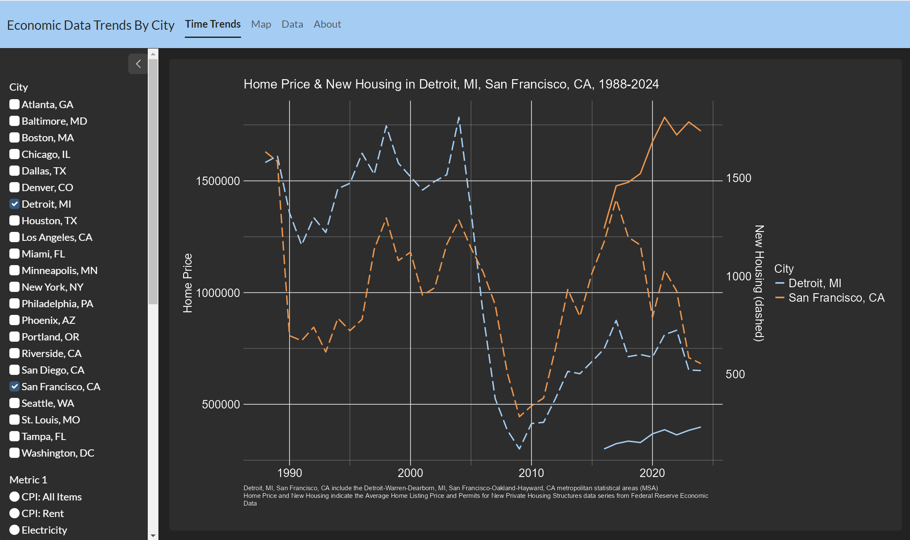
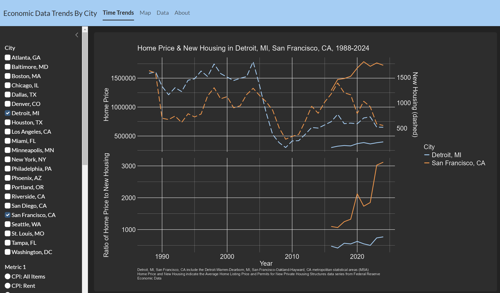
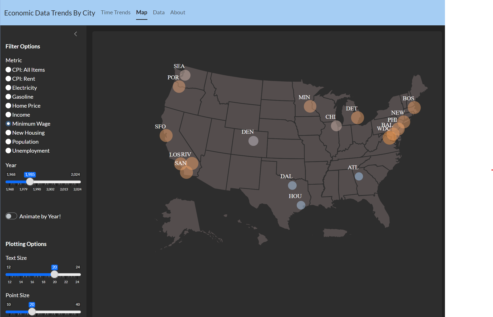
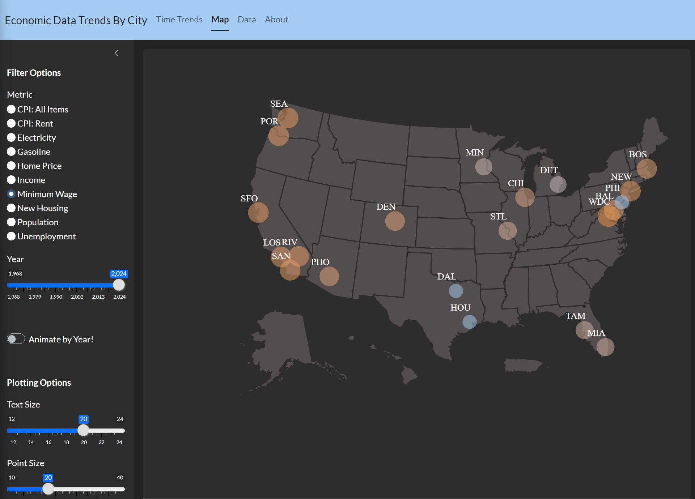

# Economic Data Trends By City 

This application is designed to allow users to explore a variety of economic statistics by United States city. These metrics can be visualized over time, in reference to other metrics, and/or by mapping. 

[Application](link)
 
[Github](https://github.com/phispu/app-cpi-eda)

#### This app includes 4 pages:
1. *Time Trends*: Creation of line graph plotting 1 or 2 economic metrics by year, stratified by selected cities. Ratio of 2 selected metrics can also be plotted by year to display relative change. 
2. *Map*: Creation of United States map displaying an economic metric for a given year. Plot can be animated to show changes by year. 
3. *Data*: Allows user to see and search data supplied to graphs.
4. *About*: Application information and links.

## A Motivating Example: Change in Home Price and New Housing 

**How has the relationship between home price and new housing units in San Francisco, CA and Detroit, MI changed overtime?**

Using the `Time Trends` tab, we can select the cities (`Detroit, MI`, `San Francisco, CA`) and metrics of interest (`Home Price`, `New Housing`) to show many aspects of these metrics in these cities. 

 

  

1. Home price data is only available since 2016 (solid line).
2. Detroit had more housing units being built prior to 2004.
3. During and leading up to the 2008 recession, both cities had a sharp decline in the number of housing units being built.
4. Home prices are much more expensive in San Francisco.

The graph makes it look like the relationship between home price and new units being built is roughly consistent in Detroit, but that home price is increasing while new units being built is decreasing in San Francisco. So let's show that by adding ratios to the plot. 

 

  

In the ratio plot it's clear that:

**Home price is changing much faster than the number of units being built in San Francisco, while the rate of change of home price and new housing is about the same in Detroit.** 

## A Motivating Example: Change in Minimum Wage

**How has minimum wage changed over time across the United States?**

Using the `Map` tab, we can select `Minimum Wage` and `1985` for the year to show what the minimum wage was in major cities across the United States in 1985. We can also hover over each city to see the minimum wage value.

 

  

1. In 1985, minimum wage was lower in southern and central cities than in coastal cities. 
2. In 1985, minimum wage in San Francisco, CA was the same as in Detroit, MI ($3.35). 

 

  

1. Minimum wage is now lower in midwestern and central-southern cities, but remains high on the west coast and in the northeast. 
2. Minimum wage in San Francisco, CA ($16.00) is now 55% higher than in Detroit, MI ($10.33).

## Data Source

All data is sourced from the [Federal Reserve Bank of St. Louis](https://fred.stlouisfed.org/). Additonal data sources may be added to future versions of this application. 

This product uses the FRED® API but is not endorsed or certified by the Federal Reserve Bank of St. Louis. By using this application, users agree to the [FRED® API Terms of Use](https://fred.stlouisfed.org/docs/api/terms_of_use.html).

#### Data Dictionary

Cities: Although the application refers to cities throughout, unless otherwise specified, metrics are sourced as the value for the metropolitan statistical area (MSA) which includes the city itself as well as the surrounding areas. The 22 largest MSAs were selected for the dataset. 

| City | Metropolitan Statistical Area | MSA Abbreviation |
| -------- | -------- | -------- |
| Atlanta, GA	| Atlanta-Sandy Springs-Roswell, GA	| ATL |
| Baltimore, MD	| Baltimore-Columbia-Towson, MD	| BAL |
| Boston, MA	| Boston-Cambridge-Newton, MA-NH	| BOS |
| Chicago, IL	| Chicago-Naperville-Elgin, IL	| CHI |
| Dallas, TX	| Dallas-Fort Worth-Arlington, TX	| DAL |
| Denver, CO	| Denver-Aurora-Lakewood, CO	| DEN |
| Detroit, MI	| Detroit-Warren-Dearborn, MI	| DET |
| Houston, TX	| Houston-The Woodlands-Sugar Land, TX	| HOU |
| Los Angeles, CA	| Los Angeles-Long Beach-Anaheim, CA	| LOS |
| Miami, FL	| Miami-Fort Lauderdale-West Palm Beach, FL	| MIA |
| Minneapolis, MN	| Minneapolis-St. Paul-Bloomington, MN-WI	| MIN |
| New York, NY	| New York-Newark-Jersey City, NY-NJ-PA	| NEW |
| Philadelphia, PA	| Philadelphia-Camden-Wilmington, PA-NJ-DE-MD	| PHI |
| Phoenix, AZ	| Phoenix-Mesa-Scottsdale, AZ	| PHO |
| Portland, OR	| Portland-Salem, OR-WA	| POR |
| Riverside, CA	| Riverside-San Bernardino-Ontario, CA	| RIV |
| San Diego, CA	| San Diego-Carlsbad, CA	| SAN |
| Seattle, WA	| Seattle-Tacoma-Bellevue, WA	| SEA |
| San Francisco, CA	| San Francisco-Oakland-Hayward, CA	| SFO |
| St. Louis, MO	| St. Louis, MO-IL	| STL |
| Tampa, FL	| Tampa-St. Petersburg-Clearwater, FL	| TAM |
| Washington, DC	| Washington-Arlington-Alexandria, DC-VA-MD-WV	| WDC |

Metrics: Metrics are economic indication values for each MSA in each year. If data is available for shorter time periods (i.e., quarter or month), the median value for the year is used for the dataset. More information is available on each metric by searching the metric description on the [Federal Reserve of St. Louis website](https://fred.stlouisfed.org/).

| Metric Identifier | Metric Description | Geographic Level |
| -------- | -------- | -------- |
| CPI: All Items	| Consumer Price Index: All Items | MSA |
| Income	| Per Capita Personal Income | MSA |
| Electricity	| Electriciy, Average Price per kWh | MSA |
| Gasoline	| Unleaded Gasoline, Average Price per Gallon | MSA |
| Home Price	| Average Home Listing Price | MSA |
| Unemployment	| Unemployment Rate | MSA |
| Population	| Resident Population, Thousands of Persons | MSA |
| CPI: Rent	| Consumer Price Index: Rent | MSA |
| Minimum Wage	| State Minimum Wage, Dollars per Hour | State |
| New Housing	| Permits for New Private Housing Structures | MSA |

## Authors 
Stephen Uong - GitHub: [phispu](https://github.com/phispu) - spp.uong@gmail.com
 
Stephen is a PhD candidate in epidemiology at Columbia University in New York, NY.

Jenny Dusendang - GitHub: [jrdusendang](https://github.com/jrdusendang) - jdusendang@gmail.com
 
Jenny is a Data Scientist working on epidemiology projects in Oakland, CA.

## Version 
1.0.0 released on 9/15/2024
